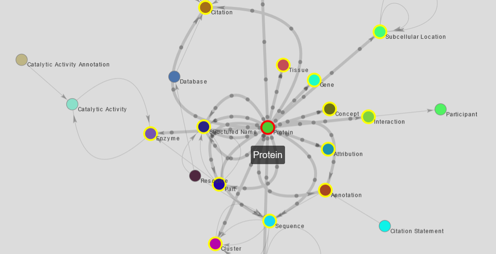
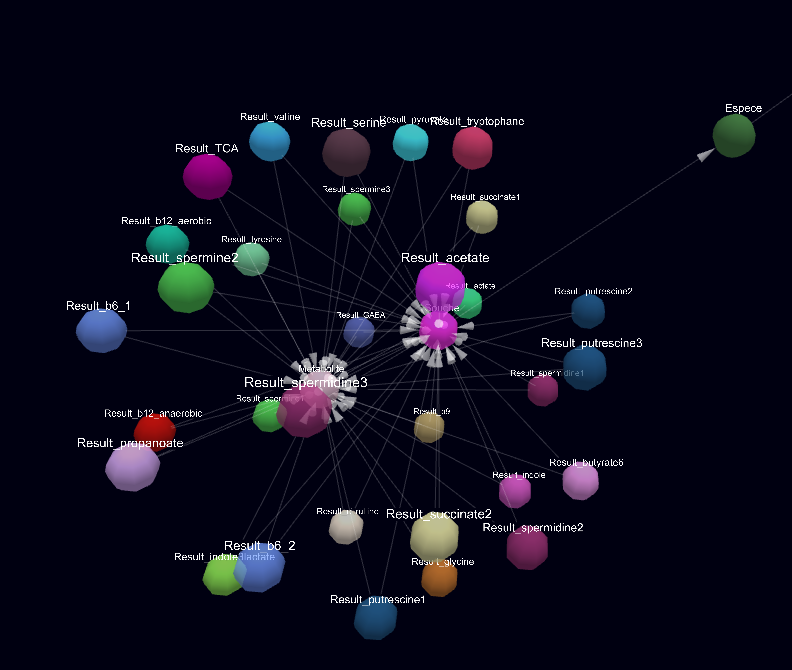

Starting from 4.5, a new <i class="fa fa-network-wired"></i> Abstraction button is available on the navigation bar.
This will lead to a graph showing all nodes and the relations available to the user.

# Abstraction overview

This graph will only show the data available to the user (ie, only public data for anonymous users)
You will be able to interact with the graph directly by dragging and scrolling.  
A 'Reset zoom' button is available to reset the zoom level.

!!! note "Info"
    Clicking on a node will zoom on it.

Two visualization modes are available: 2D and 3D.

## 2D mode

2D mode is the default visualization. In this mode, hovering over a node or a relation will highlight all related nodes, and display particles to show the direction of the relation

{: .center}

## 3D mode

You can toggle 3D mode by clicking on the '2D/3D' toggle at the top of the screen.
In this mode, you can rotate using the left-click, zoom using the mouse wheel, and pan using the right-click.

!!! warning
    There is no node/relation highlighting in this mode, due to performance issues

{: .center}
