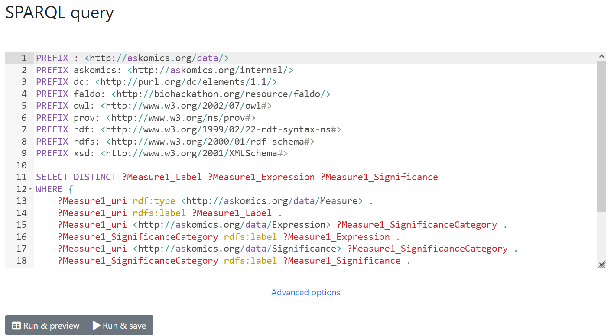

A SPARQL console is available through AskOmics, allowing you to send direct SPARQL queries to the endpoint.

!!! warning
    The console access is restricted to **logged users**

!!! warning
    The default AskOmics configuration restrict SPARQL edition and query to the administrators.  
    This can be disabled with the *enable_sparql_console* configuration option.

{: .center}

You can reach this console in two ways:

# Console access

- By clicking <btn class="white">SPARQL</btn> of an existing result in the *Results* page
    - The console will be pre-filled with the generated SPARQL query of the result
- Simply heading to the "/sparql" URL
    - The console will be pre-filled with a default SPARQL query

# Editing your query

You can edit the SPARQL query through the console to customize your query.

## Advanced options

The **Advanced options** tab allows you to customize *how* the query will be sent.  
Namely, you will be able to select which endpoints and datasets the query will use, allowing you to fine-tune the query

- For example, you can exclude some datasets to restrict the results.

!!! note "Info"
    When accessing the console through the "Results" page, the datasets of interest (relevant to the query) will already be selected. Make sure to customize the selection if you modify the query.

!!! note "Info"
    When accessing the console directly, all datasets will be selected (which can increase query time)

# Launching query

If you have **editing privileges** (either as an administrator, or through the configuration key), you will be able to either preview or save the query, much like a "normal" query.

If you save the query, it will appears as a normal result in the "Results" tab. The basic functionalities (templates, download) will be available.

!!! warning
    The <btn class="white">Redo</btn> button will be disabled for results created from the console

!!! warning
    The generated *template* will redirect to the SPARQL console. It means
    - Non-logged users will not be able to use it
    - Only logged users with **editing privileges** will be able to launch the query
