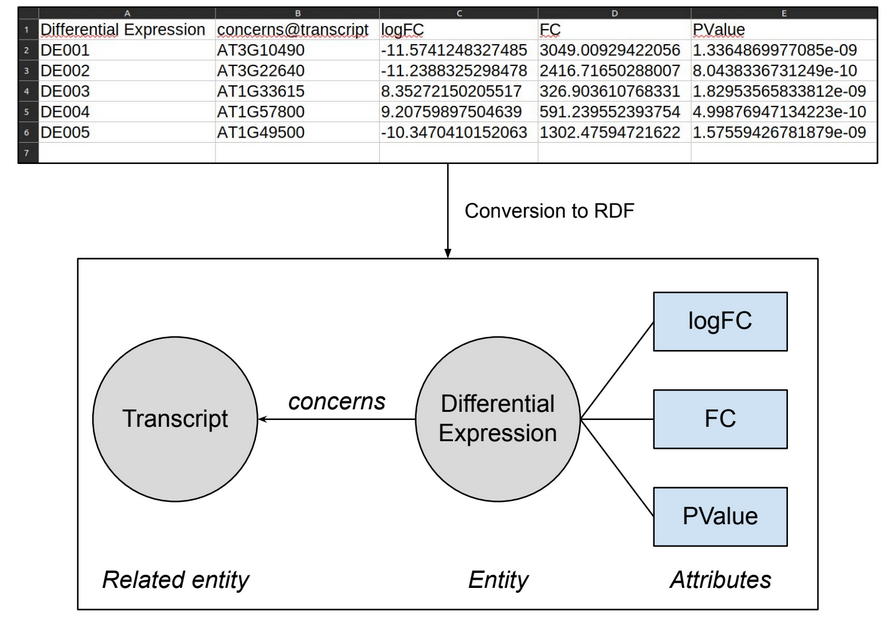
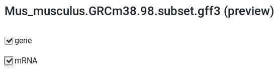

# Uploading files

You can head to the *Files* tab to manage your files. From there, you will be able to upload new files (from your local computer, or a remote endpoint), and delete them.

!!! warning
    Deleting files do not delete related datasets.

# Data visibility

By default, all your uploaded files and datasets are private.
If you have administrator privileges, you can select the <btn><i class="fa fa-globe-europe"></i>Integrate (Public dataset)</btn> button during integration to make the dataset **Public**

!!! note "Info"
    *Public* datasets will be queriable by any user, including non-logged users. They will not be able to directly access the file, but generated entities will appear on the query graph (and on the starting screen for starting entities).

!!! warning
    Make sure your public datasets do not contain sensitive information.

# CSV/TSV files

AskOmics will integrate a CSV/TSV file using its header. The *type* of each column will be predicted, but you will be able to modify it before integration.

{: .center}

## Entity (first column)

### Entity URI

The first column of the file will manage the entity itself : the column name will become the entity name, and the values will become the entity's instances **URIs**.  
**URIs** will be created as follows :

* If the value is an **URL**, it will be integrated as it is.
* If the value is a [CURIE](https://www.w3.org/TR/2010/NOTE-curie-20101216/), it will be transformed into an URL before integration. The list of managed CURIE formats is available [here](https://github.com/askomics/flaskomics/blob/master/askomics/libaskomics/prefix.cc.json).
* Else, the value will be added to either AskOmics *namespace_data* value, or a custom base URI if specified in the integration form.

!!! Warning
    Unless you are trying to merge entities, make sure your URIs are unique across **both your personal and public datasets**.

### Entity label

The values of the first column will also be transformed into the generated instances's label.

* If the value is an **URL**, the last non-empty value after a "/" or "#" will be the label.
* If the value is a **CURIE**, the value after ":" will be the label
* Else, the raw value is the label

!!! node "Info"
    For example, a one-column CSV file with the column name "Gene", and the values "gene1", "rdfs:gene2" and "http://myurl/gene3/" will create the entity *Gene*, with two instances labelled *gene1*, *gene2* and *gene3*.

### Entity type

The entity type can either be "starting entity", or "entity". If "starting entity", it may be used to start a query on the AskOmics homepage. Both types will appear as a node in the AskOmics interface.

### Inheritance

The entity can inherit the attributes and relations of a 'mother' entity. Meaning, you will be able to query the sub-entity on both its own, and its 'mother' attributes and relations. The 'mother' entity however will not have access to any 'daughter' attributes or relations.

To setup inheritance, the **column name** needs to be formated as follows:   
- *daughter_entity_name* < *mother_entity_name* (with the < symbol)
    ie: *Custom_population* < *General population*

!!! Warning
    The values of this column must be an URI of the *mother* entity

## Attributes

Each column after the first one will be integrated as an *attribute* of the entity. The column name will be set as the name of the attribute.  
Several attribute types are available. The type of an attribute will dictate the way it will be managed in the query form (eg: text field, value selector...)

!!! note 'Info'
    AskOmics will try to guess the type of a column based on its name and its values. You will be able to set it manually if the auto-detected type doesn't fit.

Attributes can be of the following types :

### Base types

- Numeric: if the values are numeric
- Text: if all values are strings
- Date: if all values are dates (using *dateutil.parser*)
    - *Auto-detected terms are 'date', 'time', 'birthday', 'day'*
- Category: if there is a limited number of repeated values
- Boolean: if the values are binary ("True" and "False", or "0" and "1")

!!! Warning
    If the date format is ambiguous (eg: 01/01/2020), AskOmics will interpret it as *day/month/year*

### FALDO types

If the entity describe a locatable element on a genome (based on the FALDO ontology):

- [Reference](http://biohackathon.org/resource/faldo#reference): chromosome *(Auto-detected terms : 'chr', 'ref', 'scaff')*
- [Strand](http://biohackathon.org/resource/faldo#StrandedPosition): strand *(Auto-detected terms : 'strand')*
- Start: start position *(Auto-detected term : 'start', 'begin')*
- End: end position *(Auto-detected terms : 'end', 'stop')*

!!! Warning
    To mark an entity as a *FALDO entity*, you need to provide **at least** a *Start* and *End* columns.  
    *Reference* and/or *Strand* are optional, but will enable more specific queries (eg: *Same reference* or *Same strand*)

### Relations

A column can also symbolize a relation to another entity. In this case, the column name must be of the form :  

- *relationName@RelatedEntityName* (with the @ symbol)
    - ie: *Derives_from@Gene*

Two types are available :

- Directed: Relation from this entity to the targeted one *(e.g. A is B’s father, but B is not A’s father)*
- Symetric: Relation that works in both directions *(e.g. A loves B, and B loves A)*

!!! Warning
    The content of the column must be URIs of the related entity.  
    *(The related entity and its URIs may be created afterwards)*

Linked URIs must match one of these three formats :

- Full URI
- CURIE
- Simple value (the value will transformed into an URI with AskOmics *namespace_data* value)

This link between entities will show up in the query screen, allowing users to query related entities.

!!! note "Info"
    **All** FALDO entities will be automatically linked with the *included_in* relation, without needing an explicit link.
    You can still specify your own relations.

!!! Warning
    For federated queries, the syntax is slightly different. Please refer to [this page](abstraction.md#linking-your-own-data) for more information.

# GFF files

!!! Warning
    Only the *GFF3* format is managed by AskOmics.

Each GFF file can be integrated into several entities. You will be able to select the entities you wish to integrate beforehand. Available entities are the values of the 'type' column of the GFF file. The relations between entities (eg: *Parents* or *Derives_from*) will also be integrated.

{: .center}

Extracted attributes are the following :

- Reference
- Strand
- Start
- End
- Any attribute in the *attributes* column
    - *Parents* and *Derives_from* will be converted in relations

!!! note "Info"
    All entities extracted from GFF files are *FALDO entities*, and will be linked implicitly with the *included_in* relation.

# BED files

Each BED file will be integrated into one entity (the default entity name will be the file name, but it can be customized).

Extracted attributes are the following :

- Reference
- Strand
- Start
- End
- Score

!!! note "Info"
    All entities extracted from BED files are *FALDO entities*, and will be linked implicitly with the *included_in* relation.

# TTL Files

You can integrate TTL files in AskOmics, either to integrate your own data, or to enable [federated queries](federation.md) to remote endpoints.  
In both case, you will need to generate or convert your data in AskOmics's format.

This can be done either [manually](abstraction.md) or [automatically](federation.md#auto-generate-external-abstraction-with-abstractor)
