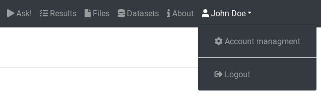

AskOmics is a collaborative web platform for data integration and query using the semantic web (RDF and SPARQL). 

## Account creation and management

### Login or signup into AskOmics

AskOmics is a mutli-user plateform. To use it, you will need an account on the instance. Use the `login` button, and log in using your AskOmics credentials. If you don't have already an account, fill the signup form by clicking on `signup` below the login form.

Once your are logged, you can use all the functionalities of AskOmics.

### Manage your account

To manage your account, use the `account` tab by clicking on your name on the navigation bar.

Uses the forms to change your personal information.

## Data integration

AskOmics convert project specific data into RDF triples automatically. It can convert CSV/TSV, GFF and BED files. It can also integrate RDF data.

### Data upload

Th first step is to upload the input files into AskOmics. Go on the `Files` tab.

You can upload files from your computer, or distant files using an URL.

### Integration

#### CSV/TSV

#### GFF

#### BED

#### RDF

