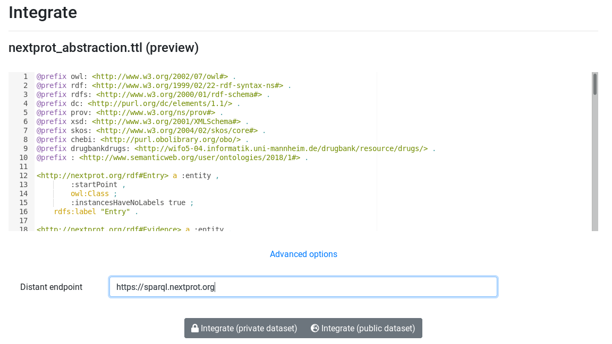
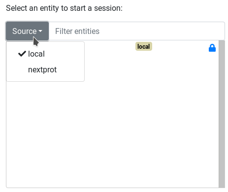

A federated query is a query who involve several SPARQL endpoints. AskOmics have his dedicated endpoint for the integrated data, but it is also possible to query external resources.


# Define an external endpoint

The first step is to define an external endpoint. External endpoint have their own description. To Display external entities, AskOmics need the *Abstraction* of the distant endpoint. This external abstraction can be build [automatically](#auto-generate-external-abstraction-with-abstractor) or [manually](abstraction.md).

## Auto-generate external abstraction with abstractor

[Abstractor](https://github.com/askomics/abstractor) is a command line tool that auto-generate an abstraction from a distant endpoint.

```bash
pip install abstractor
abstractor -e <endpoint_url> -p <entity_prefix> -o <output_file>
```

!!! Warning
    Abstractor scan all things in the SPARQL endpoint. You may wish to review the generated file to delete unwanted things.


## Integrate external abstraction into AskOmics

Once external endpoint's abstraction is generated, its time to add it into AskOmis. Upload it and integrate it.


!!! Warning
    Check that `advanced options` > `Distant endpoint` contain URL of the external endpoint


# Query external endpoint

## Starting entities

If AskOmics contain local data, external startpoint are not displayed by default on the start page. Use the `Source` dropdown button to display external entities.



## Linking to your own data

To link a local dataset to the external endpoint, the file must be structured in a certain way.

The input file must describe the relation with the external entity. Much like a 'normal' relation, it goes through the header. In this case however, the column name must contain either the full URI or the CURIE of the entity (e.g *http://nextprot.org/rdf#Gene*). The values of the column must also be the exact uri (full URI of CURIE) of the targeted entity.

For example, the file below describe en entity *gene* who is linked to an external entity *Gene*. The external one is prefixed with the full uri used in the external endpoint. In the content of the file, full URI / CURIE have to be used too.


gene|value|concern@http://nextprot.org/rdf#Gene
---|---|---
gene_1|0|http://nextprot.org/rdf/gene/ENSG00000169594
gene_2|1|http://nextprot.org/rdf/gene/ENSG00000156603


## Perform a federated query

Once the relations are described, links between local and distant entities are automatically done by AskOmics. The query is distributed to the external endpoint and results are returned like a classic query.
