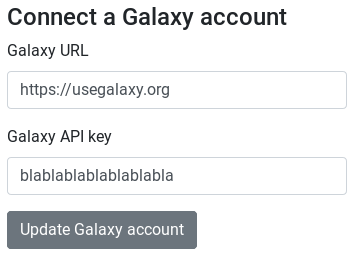

Galaxy is a scientific workflow, data integration, and data and analysis persistence and publishing platform that aims to make computational biology accessible to research scientists that do not have computer programming or systems administration experience.

AskOmics can be used with a Galaxy instance in two way:

- With a dedicated AskOmics, import Galaxy datasets into AskOmics and export AskOmics results into Galaxy.
- In Galaxy: use AskOmics Interactive Tool inside Galaxy

# Link AskOmics with Galaxy

## Create a Galaxy API key

On your Galaxy account, go to the top menu *User* → *API Keys* and copy your API key. Yhis API key is unique identifier that will be used for AskOmics to access to data.

## Enter Galaxy API key into your AskOmics account

On AskOmics, got to <navbar><i class="fa fa-user"></i> Your Name</navbar> → <navbar><i class="fa fa-cog"></i> Account management</navbar> → **Connect a Galaxy account** and enter the Galaxy URL and API Key.

Once a Galaxy account is added to AskOmics, you can access to all your Galaxy Datasets from AskOmics.

## Upload a file from Galaxy

On the <navbar><i class="fa fa-file"></i> Files</navbar> page, the <btn><i class="fa fa-upload"></i> Galaxy</btn> button can be used to browse Galaxy history and import a dataset.

## Send result and query to Galaxy

On the <navbar><i class="fa fa-tasks"></i> Results</navbar> page, the **Actions** column of the table have 2 Galaxy button.

- Send result to Galaxy: Send the result file to the last recently used history
- Send query to Galaxy: send the json graph state that represent the AskOmics query

## Import a saved query from Galaxy

On the <navbar><i class="fa fa-play"></i> Ask!</navbar> page, the <btn><i class="fa fa-upload"></i> Import Query</btn> can be used to import a saved query from Galaxy.

# Galaxy AskOmics Interactive Tool

*-- Work in progress--*
