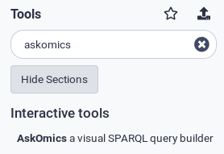
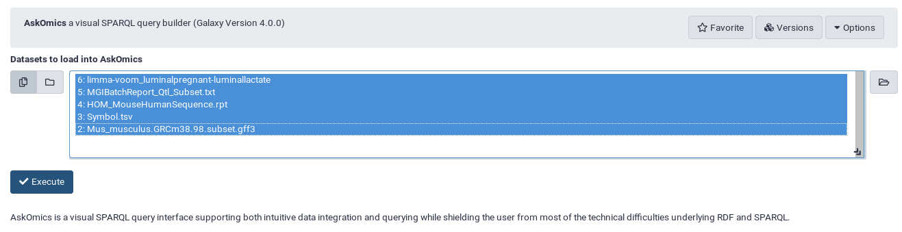
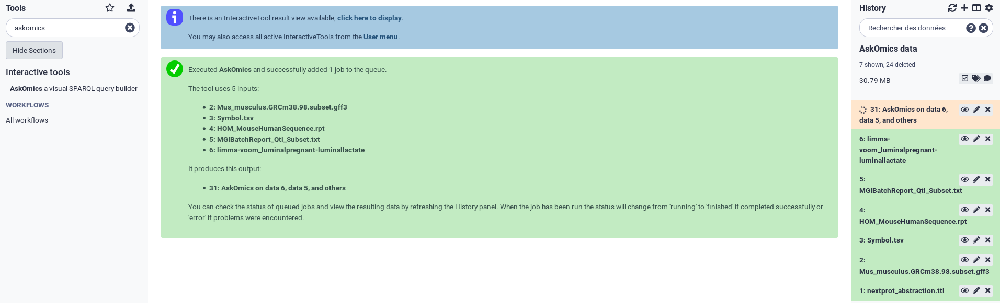
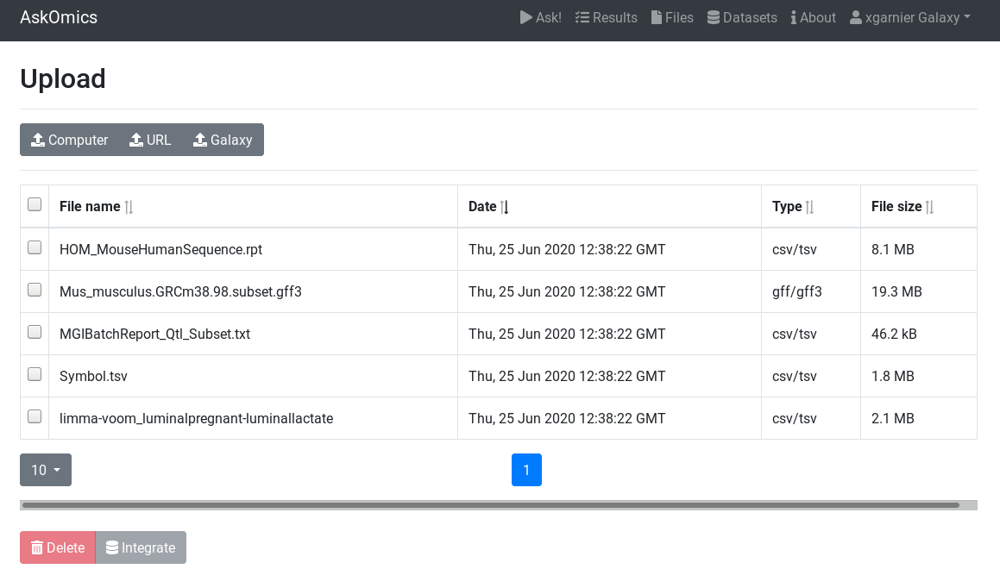
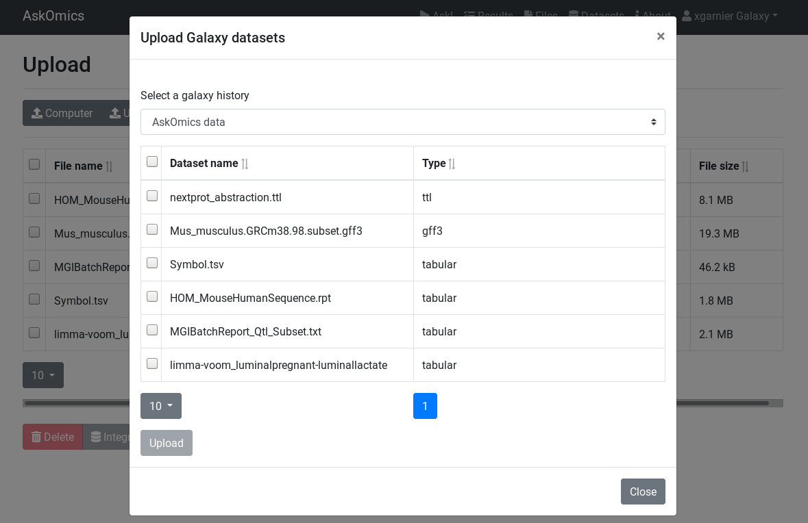
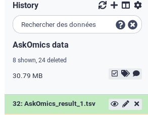

Galaxy is a scientific workflow, data integration, and data and analysis persistence and publishing platform that aims to make computational biology accessible to research scientists that do not have computer programming or systems administration experience.

A Galaxy Training tutorial is available [here](https://training.galaxyproject.org/training-material/topics/transcriptomics/tutorials/rna-seq-analysis-with-askomics-it/tutorial.html)

AskOmics can be used with a Galaxy instance in two way:

- With a dedicated AskOmics, import Galaxy datasets into AskOmics and export AskOmics results into Galaxy.
- In Galaxy: use AskOmics Interactive Tool inside Galaxy

# Link AskOmics with Galaxy

## Create a Galaxy API key

On your Galaxy account, go to the top menu *User* → *API Keys* and copy your API key. Yhis API key is unique identifier that will be used for AskOmics to access to data.

## Enter Galaxy API key into your AskOmics account

On AskOmics, got to <navbar><i class="fa fa-user"></i> Your Name</navbar> → <navbar><i class="fa fa-cog"></i> Account management</navbar> → **Connect a Galaxy account** and enter the Galaxy URL and API Key.

{: .center}

Once a Galaxy account is added to AskOmics, you can access to all your Galaxy Datasets from AskOmics.

## Upload a file from Galaxy

On the <navbar><i class="fa fa-file"></i> Files</navbar> page, the <btn><i class="fa fa-upload"></i> Galaxy</btn> button can be used to browse Galaxy history and import a dataset.

## Send result and query to Galaxy

On the <navbar><i class="fa fa-tasks"></i> Results</navbar> page, the **Actions** column of the table have 2 Galaxy button.

- Send result to Galaxy: Send the result file to the last recently used history
- Send query to Galaxy: send the json graph state that represent the AskOmics query

## Import a saved query from Galaxy

On the <navbar><i class="fa fa-play"></i> Ask!</navbar> page, the <btn><i class="fa fa-upload"></i> Import Query</btn> can be used to import a saved query from Galaxy.

# Galaxy AskOmics Interactive Tool

Galaxy Interactive Tools (GxITs) are a method to run containerized tools that are interactive in nature into the Galaxy interface. AskOmics have his GxIT available into several instances:

- [usegalaxy.eu](https://usegalaxy.eu)
- [galaxy.genouest.org](https://galaxy.genouest.org)

## Launch AskOmics IT

Search for the AskOmics Interactive tool using the search bar.

{: .center}

Choose input files to automatically upload them into AskOmics

{: .center}

!!! Tip
    You will able to add more input files later

A dedicated AskOmics instance will be deployed into the Cluster. Wait few minutes and go to the instance using the `click here to display` link.

{: .center}

Once you are into your AskOmics instance, you can see your uploaded files into the <navbar><i class="fa fa-file"></i> Files</navbar> tab.

{: .center}

## Upload additional files

in addition to the <navbar><i class="fa fa-upload"></i> Computer</navbar> and <navbar><i class="fa fa-upload"></i> URL</navbar> buttons, you can now use the <navbar><i class="fa fa-upload"></i> galaxy</navbar> button to import datasets from your galaxy histories

{: .center}

## Integrate and Query

follow the [tutorial](/tutorial#data-integration) to integrate and query your data.

## Export Results into your Galaxy history

Once you have your result, Use the `Send result to Galaxy` to export a TSV file into your last recently used Galaxy history.

{: .center}
