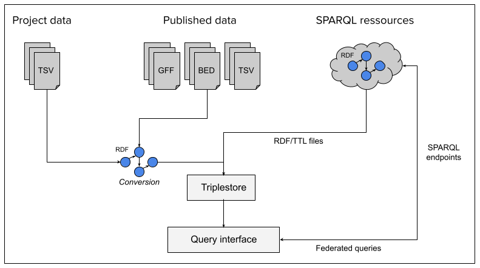

AskOmics is a visual SPARQL query interface supporting both intuitive data integration and querying while shielding the user from most of the technical difficulties underlying RDF and SPARQL.

AskOmics helps loading heterogeneous data (formatted as tabular files, GFF, BED or native RDF files) into an RDF triplestore, to be transparently and interactively queried through a user-friendly interface.

AskOmics also support federated queries to external SPARQL endpoints.

{: .center}

- AskOmics Tutorials
    - [Overview tutorial](tutorial.md): How to use AskOmics with example data
    - [Prepare your data](data.md): How to format your own data for AskOmics
    - [Building a query](query.md): Learn how the query building interface works
    - [Results interface](results.md): In-depth guide of the results interface
    - [Template & forms](template.md): An overview of the templates & forms functionalities
    - [SPARQL console](console.md): How to interact with the provided SPARQL console
    - [Command-line interface](cli.md): A python-based CLI for interacting with AskOmics
    - [Build an RDF abstraction](abstraction.md): Learn how to build an RDF abstraction for RDF data
    - [Perform federated queries](federation.md): How to query your own data with external resources
    - [Use AskOmics with Galaxy](galaxy.md): How to connect AskOmics with your Galaxy history
  

- Administration
    - [Deploy an instance](production-deployment.md): Deploy an AskOmics instance on your server
    - [Configuration](configure.md): Configure your instance
    - [Manage](manage.md): Manage your instance
  

- Developer documentation
    - [Deploy a development instance locally](dev-deployment.md)
    - [Contribute to AskOmics](contribute.md)
    - [CI](ci.md): Test your code with continuous integration
    - [Contribute to doc](docs.md): Write documentation
