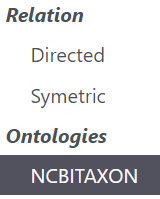

Starting for the 4.4 release, hierarchical ontologies (such as the NCBITAXON ontology) can be integrated in AskOmics.
This will allow users to query on an entity, or on its ancestors and descendants

# Registering an ontology (admin-only)

!!! warning
    While not required for basic queries (and subClassOf queries), registering an ontology is required for enabling auto-completion, using non-default labels (ie: *skos:prefLabel*), and enable an integration shortcut for users.

First, make sure to have the [abstraction file](/abstraction/#ontologies) ready. Upload it to AskOmics, and integrate it.
Make sure *to set it public*.

You can then head to <navbar><i class="fa fa-project-diagram"></i> Ontologies</navbar> in the user tab. There, you will be able to create and delete ontologies.

## Creating an ontology

Parameters to create an ontology are as follows:

* Ontology name: the full name of the ontology: will be displayed when as a column type when integrating CSV files.
* Ontology short name: the shortname of the ontology (ex: NCBITAXON). /!\ When using ols autocompleting, this needs to match an existing ols ontology
* Ontology uri: The ontology uri in your abstraction file
* Linked public dataset: The *public* dataset containing your classes (not necessarily your abstraction)
* Label uri: The label predicated your classes are using. Default to rdfs:label
* Autocomplete type: If local, autocomplete will work with a SPARQL query (local or federated). If OLS, it will be sent on the OLS endpoint.

# Linking your data to an ontology

This functionality will only work with CSV files. You will need to fill out a column with the terms uris.
If the ontology has been registered, you can directly select the ontology's column type.

{: .center}

Else, you will need to set the header as you would for a relation, using the ontology uri as the remote entity.

Ex: `is organism@http://purl.bioontology.org/ontology/NCBITAXON`

# Querying data using ontological terms

If your entity is linked to an ontology, the ontology will appears as a related entity on the graph view.
From there, you will be able to directly print the linked term's attributes (label, or other)

{: .center}

If the ontology was registered (and an autocompletion type was selected), the label field will have autocompletion (starting after 3 characters).

{: .center}

## Querying on hierarchical relations

You can also query on a related term, to build queries such as :

* Give me all entities related to the children of this term
* Give me all entities related any ancestor of this term

To do so, simply click on the linked ontology circle, fill out the required label (or other attribute), and click on the link between both ontologies to select the type of query (either *children of*, *descendants of*, *parents of*, *ancestors of*)

{: .center}

!!! warning
    The relation goes from the second ontology circle to the first. Thus, to get the *children of* a specific term, you will need to select the *children of* relation, and select the label on the **second** circle
