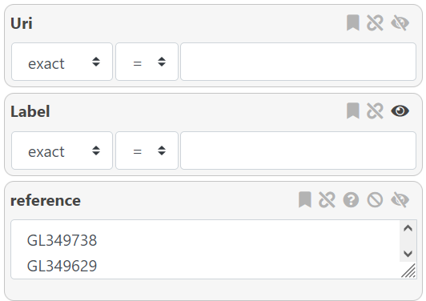
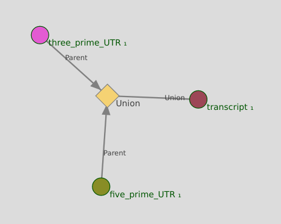

AskOmics aims to provide a simple interface able to create complex queries on linked entities.  
The query interface is customized based on available (both personal and public) integrated data.


# Starting point

Any entity integrated with the *starting entity* type can be used to start a query. Other entities can still be queried through a linked entity.  
The starting entity will start with its label already set to 'visible'.  

{: .center}
Once the start entity is chosen, the query builder is displayed.  

On the left-side of the query builder is the entity graph. Nodes (circles) represent *entities* and links represent *relations* between entities.  
The currently selected entity is surrounded by a red circle. Dotted links and entities are not yet instantiated.

{: .center}


# Filtering on attributes

The selected entity's attributes are shown as attribute boxes on the right of the graph.

!!! note "Info"
    By default, every instantiated entity (directly or through a relation) has its **label** attribute set to visible (though it can be toggled off).  

Various filters are available to further refine the query, with each attribute type having its own filter:

- Entity URI, entity label, and String attribute type: exact match or regular expression (equal or not equal)
- Numeric attribute type, FALDO start, FALDO end: comparison operators
- Category attribute type, FALDO reference, FALDO strand: Value selection among a list
- Date attribute type: comparison operators with a date picker
- Boolean attribute type: "True" or "False" selector

{: .center}

!!! note "Info"
    Due to the way SPARQL works, any result row with an empty value for **any** of its column will not be shown. You can force the display of these rows by using the <i class="fa fa-question-circle"></i> button.

!!! tip
    For the Category type, you can Ctrl+Click to either deselect a value, or select multiple values.

!!! tip
    For the Numeric and Date types, you can add filters by clicking on the "+" button.


## Additional customization

In addition to the filter, several customization options are available for each attribute box. Depending on the attribute type, not all options will be available.

{: .center}

From left to right :

- <i class="fa fa-bookmark"></i>: Mark the attribute as a **form** attribute. More information [here](template.md#forms).
- <i class="fa fa-link"></i>: Link this attribute to another (on a different entity or the same one).
    - *This will filtrer based on the linked attribute value, with an optional modifier (See note)*.
- <i class="fa fa-question-circle"></i>: Show all values for this attribute, including empty values.
- <i class="fa fa-ban"></i>: Exclude one or more categories, instead of including.
    - *Select where the attribute is not XXX*.
- <i class="fa fa-eye"></i>: Display the attribute value in the results.

!!! note "Info"
    The 'link' attribute allows you to filter based on an equality/inequality to the linked query value, with optional modifier depending on the attribute type.
    - *Numbers have optional numerical modifier*
    - *Dates have an optional days modifier*
    - *String have a custom regex, using '$1' as a placeholder for the linked value (ex: $1-suffix)*
    - *Boolean do not have a modifier*
    This allows you to do query such as : *All entities where the end position <= start position + 300*

# Filtering on related entities

To query on a linked entity, simple click on a suggested node. The linked node will be surrounded in a red circle, and the list of attributes on the right-hand side will change to show the new node's attributes.

!!! note "Info"
    Linking entity A (after filtering on parameter A1) to entity B (filtering on parameter B1) in the interface create the following query :  

    - *List all entities A who match parameter A1 , AND are linked to any entity B matching parameter B1*

## Explicit relations

Explicit relations between entities (defined by the "@" symbol in CSV files, and the *"Parents"/"Derives_from"* relations from GFF files) will appears between related entities. If the relation is a *symetric* relation, it will appear twice between entities.

## FALDO relations

All *FALDO* entities will be linked by an implicit *Included in* relation. This relation is slightly different than *explicit* relations: it relies on the *FALDO* attributes of both entities for the query, instead of a direct link.  This relation can be customized to either *Included in*, *Overlap with*, or *Distant from*.

 FALDO entities are represented with a green circle and FALDO relations have a green arrow.

!!! Tip
    You can customize the relation by clicking on the *Included in* relation.

    {: .center}

!!! note "Info"
    Entity A is *Included_in* Entity B means:

    - **Entity A Start > Entity B Start** *AND* **Entity A End < Entity B End.**

    By default, the inequalities are **Strict**, but it can be changed from the interface.  

!!! note "Info"
    Entity A *Overlap_with* Entity B means:

    - **(Entity B Start > Entity A Start** *AND* **Entity B Start < Entity A End)** *OR*
    - **(Entity B End > Entity A Start** *AND* **Entity B End < Entity A End)**

    By default, the inequalities are **Strict**, but it can be changed from the interface.  

!!! note "Info"
    *Distant from* is a special relation, that allows you to customize the position of the *start* & *stop* of your entity relative to the linked entity, with an optional modifier. This allows you to make queries such as:
    - *Entity A Start < Entity B End + 300*

!!! Tip
    If both entities have a defined *Reference* and/or *Strand* attribute, you will be able to select the **Same reference** and/or **Same strand** options. (Both are selected by default if available)

!!! Tip
    You can **reverse** the relation (Entity B *Included_in* Entity A instead of the opposite) from the interface.

!!! Warning
    *Included_in* queries are **ressource-intensive**, especially if you have a lot of instances for each entity.

## Filtering displayed relations

If there are too many related entities displayed, it can be difficult to select the entity you wish to link to. It is possible to filter the displayed relations on either the name of the entity, or the name of the link.

Simply type out the name you want to filter in either the "Filter links" or the "Filter nodes" fields on the top of the graph.

{: .center}

!!! Tip
    You can stop the *Included_in* relations from being displayed by toggling the *Show FALDO relations* button.

## Removing instanciated relations

At any point, you can remove an instanciated node **(and any node linked to it)**, by selecting the node you wish to remove, and using the **Remove Node** button at the top of the interface.


# MINUS and UNION subqueries

**Minus** and **Union** nodes are an additional way of querying on relations. Both nodes are applied to an entity as an additional filter.

- Minus nodes remove results based on a subquery
    - *Show all genes except those that match XXX*
- Union nodes act as a "OR" between multiple subqueries
    - *Show all genes that match either XXX or YYY*

Both type of nodes can be integrated in a bigger query

- *List genes linked to a mRNA, except mRNA linked to another entity*
- *List genes linked to a mRNA with either attribute A set to XXX, or attribute B set to YYY*

!!! note "Info"
    *Right-click* on any **non-instanciated** node, and select the type of node you wish to use.

    {: .center}

!!! note "Info"
    The entity affected by the special node is linked with the *Union* or *Minus* relation.  

!!! warning
    To avoid displaying empty columns or duplicates in the results, you should disable the *label* display for entities in the sub-queries.


## MINUS nodes

*Minus* nodes **remove** from the results any instance that match a specific subquery.

- **Display all genes that are not linked to an mRNA**
- **Display all genes that are not linked to an mRNA whose reference is XXX**

{: .center}


!!! tip
    It's currently the only way to query on the **lack** of relation between entities.   
    Such as: *List all instances of entity A who are not linked with any instance of entity B*

!!! note "Info"
    To add a minus node on the relation between entities A and B

    - Entity A is currently selected
    - Right-clicking on entity B and selecting "MINUS" add a new node to the graph
    - Entity B is automatically instanciated and linked to the new minus node
    - The query is now: *List all instances of entity A, without instances linked to entity B*
    - *Optional*: Disable the display of the label for entity B

The generated SPARQL query will look like this:

```turtle
# Listing all genes NOT related to an mRNA by the 'Parent' relation.

SELECT DISTINCT ?gene1_Label
WHERE {
    ?gene1_uri rdf:type <http://askomics.org/data/gene> .
    ?gene1_uri rdfs:label ?gene1_Label .
    {
        MINUS {
        ?mRNA31_uri <http://askomics.org/data/Parent> ?gene1_uri .
        ?mRNA31_uri rdf:type <http://askomics.org/data/mRNA> .
        }
    }
}   
```

!!! tip
    You can customize the sub-query further: instead of simply removing any instance linked to a specific entity, you can remove all instances linked to a specific entity whose attribute A is XXX.

    - I want to list all instances of Entity A with the attribute A1
    - But I want to exclude all instances of Entity A that are linked to any instance of Entity B with the attribute B1

    To create this query:

    1) Instantiate Entity A with attribute A1  
    2) Right-click on Entity B and select "Convert to MINUS node"  
    3) Select entity B  
    4) Select attribute B1 for entity B  

!!! note "Info"
    You can create multiple *minus* nodes starting from the same entity. Instances that match **any** of the sub-queries will be removed.

    - I want to remove instances that match *condition A*
    - I also want to remove instances that match *condition B*

    <i class="fa fa-warning"></i> This is not the same as removing instances that match *condition A* **and** *condition B* <i class="fa fa-warning"></i>  
    To do so, you will need to add conditions to an existing *minus* node instead of creating a new one.

!!! Warning
    While nested MINUS nodes are possible, the generated query might not be what you would expect. Make sure to check the generated SPARQL query in the results page if the results are not what you expected.

## UNION node

UNION nodes implement the conditional **OR**.

- Display transcripts that are either
    - Linked to a 3′-UTR
    - Linked to a 5′-UTR

{: .center}

!!! note "Info"
    Due to the way UNION nodes works, entities will appear once for each matching sub-query. This can lead to a duplication of results.  
    This can be solved by setting the label of the entities in the subquery to **Not visible** (<i class="fa fa-eye-slash"></i>)
    {: .center}

!!! Warning
    UNION nodes will only behave as a UNION if there is more than one entity linked to it

!!! note "Info"
    To add an union node on the relations between entities A, B and C

    - Entity A is currently selected
    - Right-clicking on entity B and selecting "UNION" add a new node to the graph
    - Entity B is instanciated and linked to the new union node
    - Click on Entity B and set the label to "Not visible"
    - For now, the *union* node has no effect
    - Click on the *union* node, and then click on entity C to instanciate it
    - Set the label to "Not visible"
    - The sparql query is now: *List all instances of entity A that are either linked to entity B or entity C*


The generated SPARQL query will look like this:

```turtle
# List all genes with an ortholog who has either the attribute "organism" set to "Arabidopsis thaliana", or the "reference" attribute set to "Chra01"
# Two sub-queries linked with an UNION

SELECT DISTINCT ?gene1_Label ?gene3_Label ?gene4_Label
WHERE {
    ?gene1_uri rdf:type <http://askomics.org/data/gene> .
    ?gene1_uri rdfs:label ?gene1_Label .
    {
        {
            ?gene1_uri <http://askomics.org/data/ortholog_of> ?gene26_uri .
            ?gene26_uri rdf:type <http://askomics.org/data/gene> .
            ?gene26_uri rdfs:label ?gene3_Label .
            ?gene26_uri faldo:location/faldo:begin/faldo:reference ?gene26_chromosomeCategory .
            VALUES ?gene26_chromosomeCategory { <http://askomics.org/data/Chra01> }
        }
        UNION {
            ?gene1_uri <http://askomics.org/data/ortholog_of> ?gene64_uri .
            ?gene64_uri rdf:type <http://askomics.org/data/gene> .
            ?gene64_uri rdfs:label ?gene4_Label .
            ?gene64_uri <http://askomics.org/data/organism> ?gene64_organismCategory .
            VALUES ?gene64_organismCategory { <http://askomics.org/data/Arabidopsis%20thaliana> }
        }
    }
}
```

!!! tip
    You can customize the sub-query further.  
    I want to list all instances of Entity A that are either:

    - Linked to entity B with attribute B1
    - Linked to entity C, itself linked to entity D


!!! note "Info"
    Sub-sub-queries (entities linked to the UNION node) can be as complex as you want :

    - *I want instances of entity A either linked to entities B with attribute B1, or linked entities C linked with entity D*

!!! Warning
    Just as MINUS node, nested UNION nodes might not behave as you want. Make sure to check the generated SPARQL query in the results page if the results appear to be strange.


## Removing special nodes

Much like a "normal" node, you can remove special nodes (and any node linked to it) at any time by selecting it, and using the **Remove Node** button.


# Launching queries

Once you are satisfied with your query, you can either:

- Preview the results (*at most 30 rows*) with <btn><i class="fa fa-table"></i> Run & Preview</btn>
- Send a full query with <btn><i class="fa fa-table"></i> Run & save</btn>

In the case of a full query, you will be able to access the query results (and more) on the [results page](results.md)
