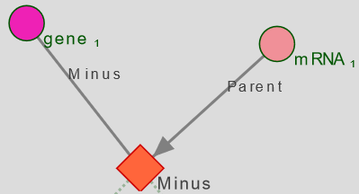

The main goal of AskOmics is to provide a simple interface able to create complex queries on linked entities.
The query interface is customized based on available (both personal and public) integrated data.

# Starting point

Any entity integrated with the "starting entity" type can be used to start a query. Other entities can still be queried through a linked entity. The starting entity will start with its label already set to 'visible'


Once the start entity is chosen, the query builder is displayed.

The query builder is composed of a graph. Nodes (circles) represent entities and links represent relations between entities. The currently selected entity is surrounded by a red circle. Dotted links and entities are not yet instantiated.


# Filtering on attributes

The currently selected entity's attribute are shown as attribute boxes on the right of the graph. By default, every instantiated entity has its **label** attribute set to visible (though it can be toggled off). Various filters are available to further refine the query.

Each attribute type has its own filters :

- Entity URI, entity label, and String attribute type: exact match or regular expression (equal or not equal)
- Numeric attribute type, FALDO start, FALDO end: comparison operators
- Category attribute type, FALDO reference, FALDO strand: Value selection among a list
- Date attribute type: comparison operators with a date picker
- Boolean attribute type: "True" or "False" selector


!!! info
    Due to the way SPARQL works, any result row with an empty value for **any** of its column will not be shown. You can force the display of these rows by using the <i class="fa fa-question-circle"></i> button.

!!! tip
    For the Category type, you can Ctrl+Click to either deselect a value, or select multiple values.

!!! tip
    For the Numeric and Date types, you can add filters by clicking on the "+" button.


## Additional customization

In addition to the filter, several customization options are available for each attribute box. Depending on the attribute type, not all options will be available.


From left to right :

- <i class="fa fa-bookmark"></i>: Mark the attribute as a **form** attribute. More information [here](template.md#forms).
- <i class="fa fa-link"></i>: Link this attribute to another (on a different entity or the same one) *(only showing rows where both attributes have the same value)*.
- <i class="fa fa-question-circle"></i>: Show all values for this attribute, including empty values.
- <i class="fa fa-ban"></i>: Exclude one or more categories, instead of including *(Select where the attribute IS NOT)*.
- <i class="fa fa-eye"></i>: Show the value of the attribute in the results.

# Filtering on related entities

To query on a linked entity, simple click on a suggested node. The linked node will be surrounded in a red circle, and the list of attributes on the right-hand side will change to show the new node's attributes.

!!! info
     Linking entity A (after filtering on parameter A1) to entity B (filtering on parameter B1) in the interface create the following query : *List all entities A who match parameter A1 , AND are linked to any entity B matching parameter B1*

## Explicit relations

Explicit relations between entities (defined by the "@" symbol in CSV files, and the "Parents" / "Derives_from" relations from GFF files) will appears between related entities. The label will be the name of the relation. If the relation is a *symetric* relation, it will appear twice between entities.

## FALDO relations

All *FALDO* entities will be linked by an implicit *Included_in* relation. This relation is slightly different than *explicit* relations: it relies on the *FALDO* attributes of both entities for the query, instead of a direct link.

!!! Tip
    You can customize the relation by clicking on the link.
    

The default *Included_in* relies on the *Start* and *End* *FALDO* attributes.

!!! info
    Entity A is *Included_in* Entity B means that **Entity A Start > Entity B Start** *AND* **Entity B End < Entity B End**
    By default, the inequalities are **Strict**, but it can be disabled from the interface.

If both entities have a defined *Reference* and/or *Strand* attribute, you will be able to select the **Same reference** and/or **Same strand** options. (Both are selected by default if available)

!!! Tip
    You can **Reverse** the relation (Entity B *Included_in* Entity A instead of the opposite) from the interface.

!!! Warning
    *Included_in* queries are **ressource-intensive**, especially if you have a lot of entities.

## Filtering displayed relations

If there are too many related entities displayed, it can be difficult to select the entity you wish to link to.
It is possible to filter the displayed relations on either the name of the entity, or the name of the link.
Simply type out the name you want to filter in either the "Filter links" or the "Filter nodes" fields on the top of the graph.


## Removing instanciated relations

At any point, you can remove an instanciated node (and any node linked to it), by selecting the node you wish to remove, and using the <button type="button" class="btn btn-secondary btn-sm">Remove Node</button> button.


# MINUS and UNION subqueries

**Minus** and **Union** nodes are an additional way of querying on relations. 

!!! info
    *Right-click* on any **non-instanciated** node, and select the type of node you wish to use.
    

## MINUS nodes

*Minus* nodes **remove** from the results any instance that match a specific subquery.

- **Display all genes that are not linked to an mRNA**
- **Display all genes that are not linked to an mRNA whose reference is XXX**




!!! tip
    It's currently the only way to query on the **lack** of relation between entities.   
    Such as: *List all entities A who are **not linked** with any instance of entity B*

!!! info
    To add a minus node on the relation between entities A and B

    - Entity A is currently selected
    - Right-clicking on entity B and selecting "MINUS" add a new node to the graph
    - Entity B is instanciated and linked to the new minus node 
    - The sparql query is now: *List all instances of entity A, but remove all instances linked to entity B*

The SPARQL query *"under the hood"* will look like this:

```turtle
# Listing all genes NOT related to an mRNA by the 'Parent' relation.

SELECT DISTINCT ?gene1_Label
WHERE {
    ?gene1_uri rdf:type <http://askomics.org/data/gene> .
    ?gene1_uri rdfs:label ?gene1_Label .
    {
        MINUS {
        ?mRNA31_uri <http://askomics.org/data/Parent> ?gene1_uri .
        ?mRNA31_uri rdf:type <http://askomics.org/data/mRNA> .
        }
    }
}   
```

!!! tip
    You can customize the sub-query further: instead of simply removing any instance linked to a specific entity, you can remove all instances linked to a specific entity whose attribute A is XXX. 

    - I want to list all instances of Entity A with the attribute A1
    - But I want to exclude all instances of Entity A that are linked to any instance of Entity B with the attribute B1

    To create this query:

    1) Instantiate Entity A with attribute A1  
    2) Right-click on Entity B and select "Convert to MINUS node"  
    3) Select entity B  
    4) Select attribute B1 for entity B  

!!! info
    You can create multiple *minus* nodes starting from the same entity. Instances that match any of the sub-queries will be removed. 

    - I want to remove instances that match *condition A*
    - I also want to remove instances that match *condition B*

    <i class="fa fa-warning"></i> This is not the same as removing instances that match *condition A* **and** *condition B*.  
    To do so, you will need to add conditions to an existing *minus* node instead of creating a new one.

!!! Warning
    While nested MINUS nodes are possible, the generated query might not be what you would expect. Make sure to check the generated SPARQL query in the results page if the results are strange.

## UNION node

UNION nodes implement the conditionnal **OR**.

- Display genes that are either
    - Linked to an mRna
    - Linked to a transcript


!!! Warning
    UNION nodes will only behave as a UNION if there are more than one entity linked to it

!!! info
    To add an union node on the relations between entities A, B and C

    - Entity A is currently selected
    - Right-clicking on entity B and selecting "UNION" add a new node to the graph
    - Entity B is instanciated and linked to the new union node
    - For now, the *union* node has no effect
    - Click on the *union* node, and then click on entity C to instanciate it 
    - The sparql query is now: *List all instances of entity A that are either linked to entity B or entity C*


The SPARQL query *"under the hood"* will look like this:

```turtle
# List all genes with an ortholog who has either the attribute "organism" set to "Arabidopsis thaliana", or the "reference" attribute set to "Chra01"
# Two sub-queries linked with an UNION

SELECT DISTINCT ?gene1_Label ?gene3_Label ?gene4_Label
WHERE {
    ?gene1_uri rdf:type <http://askomics.org/data/gene> .
    ?gene1_uri rdfs:label ?gene1_Label .
    {
        {
            ?gene1_uri <http://askomics.org/data/ortholog_of> ?gene26_uri .
            ?gene26_uri rdf:type <http://askomics.org/data/gene> .
            ?gene26_uri rdfs:label ?gene3_Label .
            ?gene26_uri faldo:location/faldo:begin/faldo:reference ?gene26_chromosomeCategory .
            VALUES ?gene26_chromosomeCategory { <http://askomics.org/data/Chra01> }
        }
        UNION {
            ?gene1_uri <http://askomics.org/data/ortholog_of> ?gene64_uri .
            ?gene64_uri rdf:type <http://askomics.org/data/gene> .
            ?gene64_uri rdfs:label ?gene4_Label .
            ?gene64_uri <http://askomics.org/data/organism> ?gene64_organismCategory .
            VALUES ?gene64_organismCategory { <http://askomics.org/data/Arabidopsis%20thaliana> }
        }
    }
}
```

!!! tip
    You can customize the sub-query further: 


!!! info
    Sub-sub-queries (entities linked to the UNION node) can be as complex as you want : *I want instances of entity A either linked to entities B with attribute B1, or linked entities C linked with entity D*

!!! Warning
    Just as MINUS node, nested UNION nodes might not behave as you want. Make sure to check the generated SPARQL query in the results page if the results appear to be strange.


## Removing special nodes

Much like a "normal" node, you can remove special nodes (and any node linked to it) at any time by selecting it, and using the <button type="button" class="btn btn-secondary btn-sm">Remove Node</button> button.


# Launching queries

Once you are satisfied with your query, you can either preview the results with <btn><i class="fa fa-table"></i> Run & Preview</btn> (listing at most 30 results), or send a full query with <btn><i class="fa fa-table"></i> Run & save</btn> .

In the case of a full query, you will be able to access the query results (and more) on the [results page](results.md)
