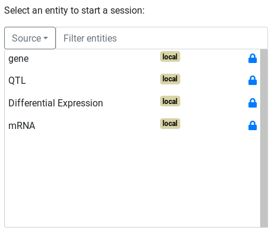

The main goal of AskOmics is to provide a simple interface able to create complex queries on linked entities.
The query interface is customized based on available (both personal and public) integrated data.

# Starting point

Any entity integrated with the "starting entity" type can be used to start a query. Other entities can still be queried through a linked entity. The starting entity will start with its label already set to 'visible'

# Query interface

Once the start entity is chosen, the query builder is displayed.

The query builder is composed of a graph. Nodes (circles) represent entities and links represent relations between entities. The currently selected entity is surrounded by a red circle. Dotted links and entities are not yet instantiated.

## Entity attributes

The currently selected entity's attribute are shown as attribute boxes on the right of the graph. By default, every instantiated entity has its **label** attribute set to visible (though it can be toggled off). Various filters are available to further refine the query.

Each attribute type has its own filters :

- Entity URI, entity label, and String attribute type: exact match or regular expression (equal or not equal)
- Numeric attribute type, FALDO start, FALDO end: comparison operators
- Category attribute type, FALDO reference, FALDO strand: Value selection among a list
- Date attribute type: comparison operators with a date picker
- Boolean attribute type: "True" or "False" selector

!!! Warning
    Due to the way SPARQL works, any result row with an empty value in **any** of its column will not be shown. You can force the display of these rows by using the <i class="fa fa-question-circle></i> button.

!!! info
    For the Category type, you can Ctrl+Click to either deselect a value, or select multiple values.

!!! info
    For the Numeric and Date types, you can add filters by clicking on the "+" button.

### Additional customization

In addition to the filter, several customization options are available for each attribute box. Depending on the attribute type, not all options will be available.

From left to right :

- <i class="fa fa-bookmark"></i>: Mark the attribute as a **form** attribute. More information [here](template.md).
- <i class="fa fa-link"></i>: Link this attribute to another (on a different entity or the same one) *(only showing rows where both attributes have the same value)*.
- <i class="fa fa-question-circle"></i>: Show all values for this attribute, including empty values.
- <i class="fa fa-ban"></i>: Exclude one or more categories, instead of including *(Select where the attribute IS NOT)*.
- <i class="fa fa-eye"></i>: Show the value of the attribute in the results.

## Linking entities

To query on a linked entity, simple click on a suggested node. The linked node will be surrounded in a red circle, and the list of attributes on the right-hand side will change to show the new node's attributes.

!!! info
     Linking entity A (after filtering on parameter A1) to entity B (filtering on parameter B1) in the interface create the following query : *List all entities A who match parameter A1 , AND are linked to any entity B matching parameter B1*

### Filtering relations

### Removing relations

### Explicit relations

Explicit relations between entities (defined by the "@" symbol in CSV files, and the "Parents" / "Derives_from" relations from GFF files) will appears between related entities. The label will be the name of the relation. If the relation is a *symetric* relation, it will appear twice between entities.

### FALDO relations

All *FALDO* entities will be linked by an implicit *Included_in* relation. This relation is slightly different than *explicit* relations: it relies on the *FALDO* attributes of both entities for the query, instead of a direct link.

!!! info
    You can customize the relation by clicking on the link.

The default *Included_in* relies on the *Start* and *End* *FALDO* attributes.

!!! info
    Entity A is *Included_in* Entity B means that **Entity A Start > Entity B Start** *AND* **Entity B End < Entity B End**
    By default, the inequalities are **Strict**, but it can be disabled from the interface.

If both entities have a defined *Reference* and/or *Strand* attribute, you will be able to select the **Same reference** and/or **Same strand** options. (Both are selected by default if available)

!!! info
    You can **Reverse** the relation (Entity B *Included_in* Entity A instead of the opposite) from the interface.

!!! Warning
    *Included_in* queries are **ressource-intensive**, especially if you have a lot of entities.

## MINUS and UNION nodes

In addition to querying on attributes and relations, it is possible to use both **MINUS** and **UNION** *SPARQL* concepts.

!!! info
    Simply *right-click* to any **non-instanciated** node, and select the type of concept you wish to use.

## MINUS nodes

The behavior of *MINUS* nodes is the following:

- A sub-query is created for listing the instances of the selected entity (the entity linked to the *MINUS* node with the *minus* relation)
- Any instance of the entity matching this sub-query will be removed from the main query

For instance:

- I want to list all instances of Entity A with the attribute A1
- But I want to exclude all instances of Entity A that are linked to Entity B with the attribute B1

To create this query:
1) Instantiate Entity A with attribute A1
2) Right-click on Entity B and select "Convert to MINUS node"
3) Select entity B
4) Select attribute B1 for entity B

!!! Warning
    When you instantiate a MINUS node, by default no attributes are selected, meaning the query is *Exclude all instances of entity A which are linked to ANY entity B*

!!! info
    The MINUS sub-query can be as extensive as you want (Excluding instances of entity A linked to entity B linked to entity C)

!!! info
    You can use multiple MINUS nodes on the same entity (Exclude instances of entity A linked to entity B, and instances of entity A linked to entity C)

!!! Warning
    While nested MINUS node are possible, the generated query might not be what you would expect. Make sure to check the generated SPARQL query in the results page if the results appear to be strange.

### UNION node

Creating an UNION node behaves as creating an UNION sub-query. **Any** link to this node will be managed as a sub-sub-query, part of the UNION sub-query.

For instance:

- I want to list all instances of entity A that are **EITHER**
- Linked to entity B
- OR linked to entity C

To create this query:
1) Instantiate entity A
2) Right-click on entity B and select "Convert to UNION node"
3) Entity B is already linked to the UNION node
4) Instantiate entity C by clicking on it

!!! Warning
    UNION nodes will only behave as a UNION if there are more than one entity linked to it

!!! info
    Sub-sub-queries (entities linked to the UNION node) can be as complex as you want : *I want instances of entity A either linked to entities B with attribute B1, or linked entities C linked with entity D*

!!! Warning
    Just as MINUS node, nested UNION nodes might not behave as you want. Make sure to check the generated SPARQL query in the results page if the results appear to be strange.
