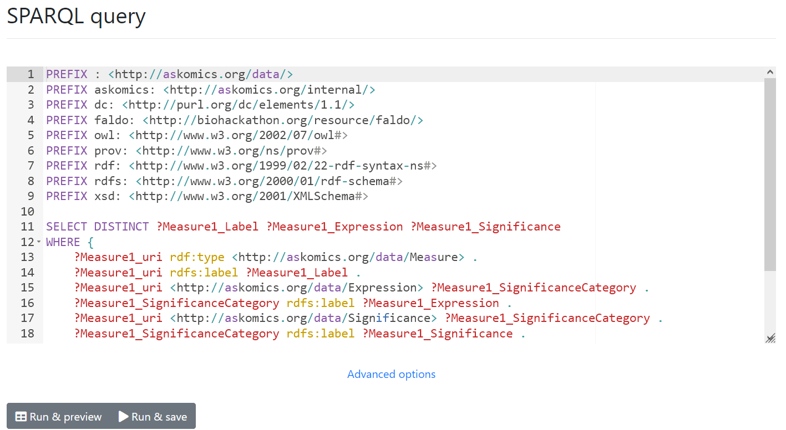

On the Results page, you will be able to see all your saved results (after using the <btn><i class="fa fa-save"></i> Run & save</btn> button). Each row stores both the query and its results.

# General information

Result information can be found for each row :

- Creation data: The creation time of this result
- Exec time: The running time of the linked query
- Status: Current status of the query
    - Possible values are 'Success', 'Queued', 'Started', 'Failure' and 'Deleting'
- Rows: Number of rows in the result
- Size: Size of the result file

## Description

Each description can be customized by clicking on the field, and entering the desired value. You can use this to identify the query related to this result.

!!! Warning
    Don't forget to save your new description using **Enter**

!!! note "Info"
    The description will be displayed on the main page if you transform this query in a [template or form](template.md).

# Templates and forms

You can use the available toggle buttons if you wish to create a [template or form](template.md).

!!! Warning
    Form creation is restricted to administrators. The related query must also be a [form-able query](template.md#Forms).

# Publication

The 'Public' toggle is available if you are an administrator. If will automatically create a public form (if the result is form-able), or a template. They will be accessible to **all users** from the main page.

!!! Tip
    Make sure to set a custom description (and [customize your form](template.md#editing-the-form-display), if relevant) to help users understand your template/form.

# Actions

Several actions are also available for each result :

## Preview

<btn class="white">Preview</btn> directly re-launch the related query, and print a preview of the results.
The preview will be shown under the results table.

## Download

Clicking on <btn class="white">Download</btn> will let you download a CSV file containing the results.

## Form

Clicking on <btn class="white">Form</btn> will let you customize the related form display.

!!! Warning
    Only available for administator and form-able results.

## Redo

Clicking on <btn class="white">Redo</btn> will let you directly replay the query from the query interface. It will be in the exact same state as when you clicked on <btn><i class="fa fa-save"></i> Run & save</btn>.

!!! Warning
    Only available results generated from the query interface.

## Sparql

Clicking on <btn class="white">Sparql</btn> will redirect you to the [SPARQL console](console.md). You will be able to browse the SPARQL code generated by your query.

!!! note "Info"
  Depending on your AskOmics configuration, you might be able to directly customize the query and launch it from the console.

{: .center}

# Deletion

To delete one or more results, simply select them in the table, and use the "Delete" button at the bottom of the table.

!!! Warning
    This will delete any template or form generated from the result.
