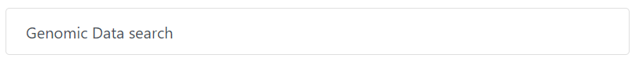

One of the goal of AskOmics is to enable re-use and customization of complex queries shared by other users.
This functionality is available in two different ways.

# Templates

Templates are a simple way for yourself or another user to replay your queries. They will access a **copy** of the query graph, and be able to customize all parameters and relations (this includes linking to additional entities).

Templates will appears on the right-side of the homepage. The description of the template can be customized to include more information regarding the query.

!!! Warning
    By default, your templates are private. To publicize them, you need administrator privileges.

## Creating a template

To create a template, first create the query you want, and <btn><i class="fa fa-table"></i> Run & save</btn>.
Then, in the result page, you can toggle the 'template' attribute to create the template.

## Editing the template description

You can modify the template description the same way you would edit the result description. Simple click on the value of the 'Description' column, and enter your own description.

!!! Warning
    Don't forget to save with the **Enter** key.

## Using the template

On the AskOmics homepage, simply click on the template of interest to access the query interface. From there, you can simply interact with it as you would with a normal query, including saving the results.

{: .center}

!!! note "Info"
    Any change to the query will not affect the template.

## Removing the template

To remove the template, you can either toggle the 'template' attribute back to *off*, or delete the result as a whole.

# Forms

Whereas templates allow users to completely replay your queries (including modifying the query graphs), forms aim to be a much simpler way to share your queries for users not familiar with the way AskOmics works.

!!! Warning
    Forms are restricted to administrators.

When using a form, other users will only able to change the values for a set of parameters you will have selected beforehand.

For instance, if your query is *List all users whose favorite color is red*, users will only be able to change the favorite color, before sending the query.

{: .center}

In addition, you will be able to customize the form before sharing it, such as changing the description (much like templates), but also the name of each entity and attribute.

Like templates, forms will appear on the right side of the homepage, with the chosen description.

!!! Warning
    Users will only be able to interact with *form attributes*. They will not be able to affect or change visibility for other attributes.

!!! Warning
    A given **Result** can be either a form or a template, but not both.

## Creating a form

To create a form, you will first to create a **form-ifiable** query. To do so, start with a regular query, and toggle the template ( <i class="fa fa-bookmark"></i> ) button on all attributes of interest. Selected attributes will be modifiable in the form.

After saving the query with <btn><i class="fa fa-table"></i> Run & save</btn>, head to the *Results* page.
You will be able to toggle the 'Form' button, creating the form.

!!! Warning
    The form creation option is restricted to form-ifiable (meaning, with at least one selected attribute) queries.

## Editing the form description

You can modify the form description the same way you would edit the result (and template) description. Simple click on the value of the 'Description' column, and enter your own description.

!!! Warning
    Don't forget to save with the **Enter** key.

## Editing the form display

For each entity with a form attribute, the form will display both the entity name, and each attribute label (in addition to the input field). You can customize this display (for instance, changing the display entity name to something more readable, or changing an attribute label to make your query more explicit)

To do so, simply click on <btn class="white">Form</btn> to access the *form editing interface*.
You can then simply edit entities and attributes labels, and click on <btn><i class="fa fa-save"></i> Save</btn> to save the new display.

{: .center}

!!! Warning
    The query results will not be affected by these changes (the column name will still match the default attribute label).

## Using the form

On the AskOmics homepage, simply click on the form of interest to access the interface.

{: .center}

## Removing the form

To remove the form, you can either toggle the 'form' attribute back to *off*, or delete the result as a whole.
