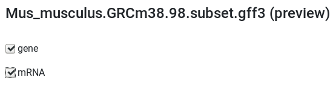
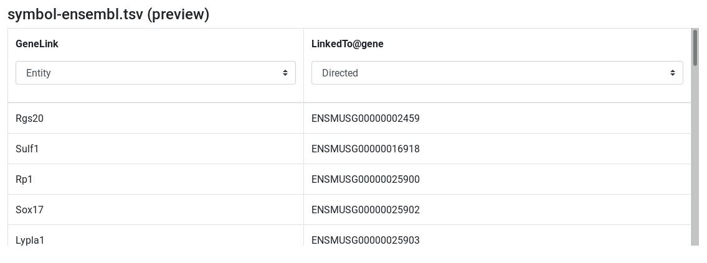

AskOmics is a web software for data integration and query using the Semantic Web technologies. It helps users to convert multiple data sources (CSV/TSV files, GFF and BED annotation) into RDF triples, and perform complex queries using a user-friendly interface.

In this tutorial, we will learn the basics of AskOmics by analyses RNA-seq results. The data comes from a differential expression analysis and are provided for you. 4 files will be used in this tutorial:

- [Differentially expressed results file](https://zenodo.org/record/2529117/files/limma-voom_luminalpregnant-luminallactate): genes in rows, and 4 required columns: identifier (ENTREZID), gene symbol (SYMBOL), log fold change (logFC) and adjusted P values (adj.P.Val)
- [Reference genome annotation file](https://zenodo.org/record/3601076/files/Mus_musculus.GRCm38.98.subset.gff3) in GFF format
- [Correspondence file between gene symbol and Ensembl id](https://zenodo.org/record/3601076/files/symbol-ensembl.tsv): TSV with two columns: symbol and the corresponding Ensembl id
- [QTL file](https://zenodo.org/record/3601076/files/MGIBatchReport_Qtl_Subset.txt): QTL in row, with 5 required columns: identifier, chromosome, start, end and name

Throughout the guide, you will find <badge class="hands-on">Hands-on</badge> containing instructions to perform in order to get started with AskOmics.

To complete the tutorial, you will need an AskOmics instance. You can [install your own](production-deployment.md) or use this [public instance](https://use.askomics.org).

A Galaxy Training tutorial is also available [here](https://training.galaxyproject.org/training-material/topics/transcriptomics/tutorials/rna-seq-analysis-with-askomics-it/tutorial.html)

# Account creation and management

## Login or signup into AskOmics

AskOmics is a multi-user platform. To use it, you will need an account on the instance. Use the <navbar><i class="fa fa-sign-in"></i> Login</navbar> button on the navbar, and log in using your AskOmics credentials. If you don't have already an account, fill the signup form by clicking on <askolink>signup</askolink> below the login form.

!!! Hands-on
    Create your AskOmics account (or login with your existing one)

Once you are logged, you can use all the functionalities of AskOmics.

## Manage your account

To manage your account, use the <navbar><i class="fa fa-cog"></i> Account management</navbar> tab by clicking on <navbar><i class="fa fa-user"></i> Your Name &#9662;</navbar> on the navigation bar.

Use the forms to change your personal information.

# Data integration

AskOmics will convert project specific data into RDF triples automatically. It can convert CSV/TSV, GFF and BED files.

!!! Hands-on
    Download the files for the tutorial using the following links: 
    - [Differentially expressed results file](https://zenodo.org/record/2529117/files/limma-voom_luminalpregnant-luminallactate) 
    - [Reference genome annotation file](https://zenodo.org/record/3601076/files/Mus_musculus.GRCm38.98.subset.gff3) 
    - [Correspondence file between gene symbol and Ensembl id](https://zenodo.org/record/3601076/files/symbol-ensembl.tsv) 
    - [QTL file](https://zenodo.org/record/3601076/files/MGIBatchReport_Qtl_Subset.txt)

## Data upload

The first step is to upload the input files into AskOmics. Go on the *Files* page by clicking on <navbar><i class="fa fa-file"></i> Files</navbar>.

You can upload files from your computer, or distant files using an URL.

!!! Hands-on
    Upload the files `limma-voom_luminalpregnant-luminallactate`, `Mus_musculus.GRCm38.98.subset.gff3`, `symbol-ensembl.tsv` and `MGIBatchReport_Qtl_Subset.txt` from your computer into AskOmics

!!! Tip
    You can also copy files URL and use the <navbar><i class="fa fa-upload"></i> URL</navbar> button.

Uploaded files are displayed into the files table. Filenames can be changed by clicking on it.

{: .center}

Next step is to convert this files into RDF triples. This step is called *Integration*. Integration will produce a RDF description of your data: the *Abstraction*.

!!! Hands-on
    Select the four files and click on <btn><i class="fa fa-database"></i> Integrate</btn>

## Integration

The *integration* convert input files into RDF triples, and load them into an RDF triplestore. AskOmics can convert CSV/TSV, GFF3 and BED files. During the step of integration, AskOmics show a preview of each files. We can choose how the file will be integrated at this step.

More information about data integration is available [here](data.md)

### GFF

GFF files contain genetic coordinate of entities. Each entity contained in the GFF file is displayed on the preview page. We can Select the entities that will be integrated.

!!! Hands-on
    1. Search for `Mus_musculus.GRCm38.98.subset.gff3 (preview)`
    2. Select `gene` and `mRNA`
    3. <btn>Integrate (Private dataset)</btn>

    {: .center}

### CSV/TSV

The TSV preview show an HTML table representing the TSV file. During integration, AskOmics will convert the file using the header.

<!-- First col: entity, then, attribute -->
The first column of a TSV file will be the *entity* name. Other columns of the file will be *attributes* of the *entity*. *Labels* of the *entity* and *attributes* will be set by the header. This *labels* can be edited by clicking on it.  

<!-- Attribute types -->
Entity and attributes can have special types. The types are defined with the select below the header. An *entity* can be a *start entity* or an *entity*. A *start entity* mean that the entity may be used to start a query.

Attributes can take the following types:

- Numeric: if all the values are numeric
- Text: if all the values are strings
- Date: if all the values are dates
- Category: if there is a limited number of repeated values

If the entity describe a locatable element on a genome:

- Reference: chromosome
- Strand: strand
- Start: start position
- End: end position

<!-- Relation -->
A columns can also be a relation between the *entity* to another. In this case, the header have to be `relationName@TargetedEntity` and the type *Directed* or *Symmetric* relation. a *Directed* relation is a relation from this entity to the targeted one. A *Symetric relation* is a relation on both directions.

!!! Hands-on
    1. Search for `limma-voom_luminalpregnant-luminallactate (preview)`
    2. Edit attribute names and types:
        - change `ENTREZ ID` to `Differential Expression` and set type to *start entity*
        - change `SYMBOL` to `linkedTo@GeneLink` and set type to *Directed relation*
        - change `GENENAME` to `name` and set type to *text*
        - Keep the other column names and set their types to *numeric*
    3. <btn>Integrate (Private dataset)</btn>

    {: .center}

!!! Hands-on
    1. Search for `symbol-ensembl.tsv (preview)`
    2. Edit attribute names and types:
        - change `symbol` to `GeneLink` and set type to *entity*
        - change `ensembl` to `linkedTo@gene` and set type to *Directed relation*
    3. <btn>Integrate (Private dataset)</btn>

    {: .center}

!!! Hands-on
    1. Search for `MGIBatchReport_Qtl_Subset.txt (preview)`
    2. Edit attribute names and types:
        - change `Input` to `QTL` and set type to *start entity*
        - set `Chr` type to *Reference*
        - set `Start` type to *Start*
        - set `End` type to *End*
    3. <btn>Integrate (Private dataset)</btn>

    {: .center}

### Manage integrated datasets

Integration can take some times depending on the file size. The <navbar><i class="fa fa-database"></i> Datasets</navbar> page show the progress.

!!! Hands-on
    1. Go to <navbar><i class="fa fa-database"></i> Datasets</navbar> page
    2. Wait for all datasets to be *success*

    {: .center}

The table show all integrated datasets. The *status* column show if the datasets are fully integrated or in the process of being integrated.

# Query

Once all the data of interest is integrated (converted to RDF graphs), its time to query them. Querying RDF data is done by using the SPARQL language. Fortunately, AskOmics provides a user-friendly interface to build SPARQL queries without having to learn the SPARQL language.

More information about the query building process is available [here](query.md)

## Query builder overview

### Simple query

The first step to build a query is to choose a start point for the query.

{: .center}

!!! Hands-on
    1. Go to <navbar><i class="fa fa-play"></i> Ask!</navbar> page
    2. Select the *Differential Expression* entity
    3. <btn>Start!</btn>

Once the start entity is chosen, the query builder is displayed.

The query builder is composed of a graph. Nodes represents *entities* and links represents *relations* between entities. The selected entity is surrounded by a red circle. Links and other entities are dotted and lighter because there are not instantiated.

{: .center}

On the right, attributes of the selected entity are displayed as attribute boxes. Each boxes have an eye icon. Open eye mean the attribute will be displayed on the results.

!!! Hands-on
    1. Display `logFC` and `adj.P.val` by clicking on the <i class="fa fa-eye"></i> eye icon
    2. <btn><i class="fa fa-table"></i> Run & preview</btn>

{: .center}

<btn><i class="fa fa-table"></i> Run & preview</btn> launch the query with a limit of 30 rows returned. We use this button to get an idea of the results returned.

### Filter on attributes

Next query will search for all over-expressed genes. Genes are considered over-expressed if the log fold change is > 2. We are only interested by significant results (Adj P value ≤ 0.05)

!!! Hands-on
    1. Filter `logFC` with `>` `2`
    2. Filter `adj.P.val` with `≤` `0.05`
    2. <btn><i class="fa fa-table"></i> Run & preview</btn>

Results show only significantly over-expressed genes.

### Filter on relations

Now that we have our genes if interest, we will link these genes to the reference genome to get information about the location.

To constraint on a relation, we have to click on any suggested nodes linked to our entity of interest.

!!! Hands-on
    1. First, hide `Label`, `logFC` and `adj.P.val` of `Differential Expression`
    2. Instantiate `GeneLink`, and hide `Label`
    3. Instantiate `gene`
    2. <btn><i class="fa fa-table"></i> Run & preview</btn>

Results now show the Ensembl id of our over-expressed genes. We have now access to all the information about the `gene` entity containing on the GFF file. For example, we can filter on chromosome and display chromosome and strand to get information about the gene location.

!!! Hands-on
    1. Show `reference` and `strand` using the eye icon
    2. Filter `reference` to select `X` and `Y` chromosomes (use `ctrl`+`click` to multiple selection)
    2. <btn><i class="fa fa-table"></i> Run & preview</btn>

### Use FALDO ontology to query on the position of elements on the genome.

The [FALDO](https://bioportal.bioontology.org/ontologies/FALDO) ontology describe sequence features's positions and regions. AskOmics use the FALDO ontology to represent entity positions.  
All entities extracted from GFF and BED files use this ontology, in addition to any entity extracted from a CSV/TSV file with a reference, strand, start and end columns.

The FALDO ontology is used in AskOmics to perform special queries between 2 FALDO entities. These queries are:

- Entity is included in another entity
- Entity is overlapping another entity

On the query builder interface, FALDO entities are represented with a green circle and FALDO relations have a green arrow.

!!! Hands-on
    1. First, remove the reference filter (unselect `X` and `Y` using `ctrl`+`click`)
    2. Hide `strand` and `reference` using the eye
    3. Instantiate `QTL`
    4. Click on the link between `gene` and `QTL` to edit the relation
    5. check that the relation is `gene` `included in` `QTL` `on the same reference` with `strict` ticked
    7. <btn><i class="fa fa-table"></i> Run & preview</btn>

To go further, we can filter on `QTL` to refine the results.

!!! Hands-on
    1. Go back to the `QTL` node
    2. Show the `Name` attribute using the eye icon
    3. Filter the name with a `regexp` with `growth`
    4. <btn><i class="fa fa-table"></i> Run & preview</btn>

From now, our query is "All Genes that are over-expressed (logFC > 2 and FDR ≤ 0.05) and located on a QTL that are related to growth" This is the results that we are looking for. We can now save it.

!!! Hands-on
    1. <btn><i class="fa fa-table"></i> Run & save</btn>
    2. Go to the <navbar><i class="fa fa-tasks"></i> Results</navbar> page

## Results management

The results page store the saved queries. A table show some useful information about the queries. Query name can be edited by clicking on it.

!!! Hands-on
    1. Click on the name and enter `Over-expressed genes on a growth QTL`
    2. press `enter` key

    {: .center}

The **Action** column contain buttons to perform certain action:

- Preview: show a results preview on the bottom of the table
- Download: Download the results (TSV file)
- Edit: Edit the query with the query builder
- SPARQL: edit the query with a SPARQL editor for advanced users

For more information about the Results page, please head [here](results.md)

!!! Hands-on
    1. Download the results file on your computer using <btn class="white">Download</btn> button.

The "Edit" button can be used to simply replay the query after changing some parameters.

!!! Hands-on
    1. Edit the query, and replace "growth" with another term of interest (such as "anxiety").
    2. Preview the results

## Advanced queries

Advanced queries, including *UNION* and *MINUS* SPARQL queries are also available to further your queries.  
Please head [here](query.md#minus-and-union-nodes) for more information.

# Conclusion

In this tutorial we have seen how to use the AskOmics Interactive Tool, building a complex SPARQL query to interrogate 4 different datasets and answer a biological question.
