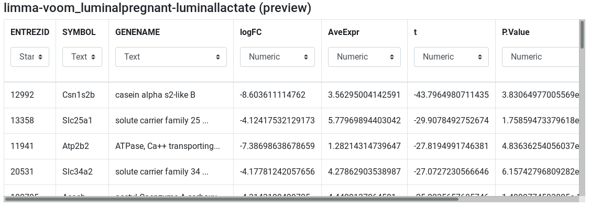
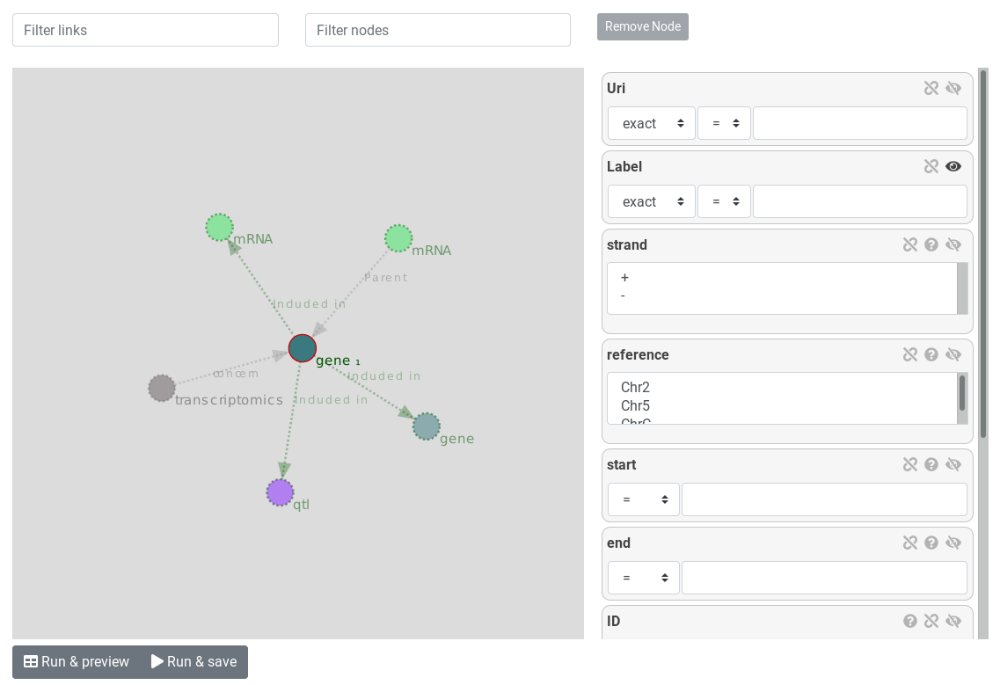
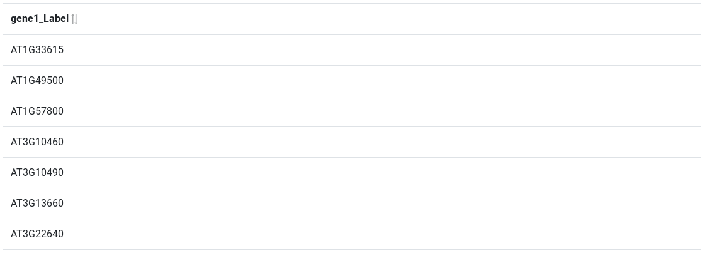
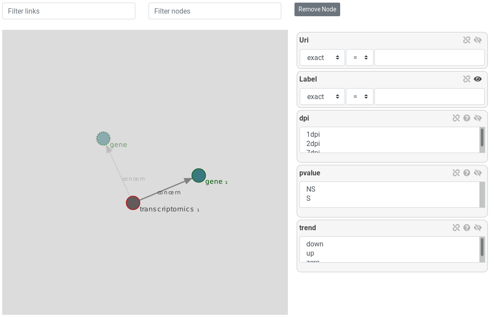
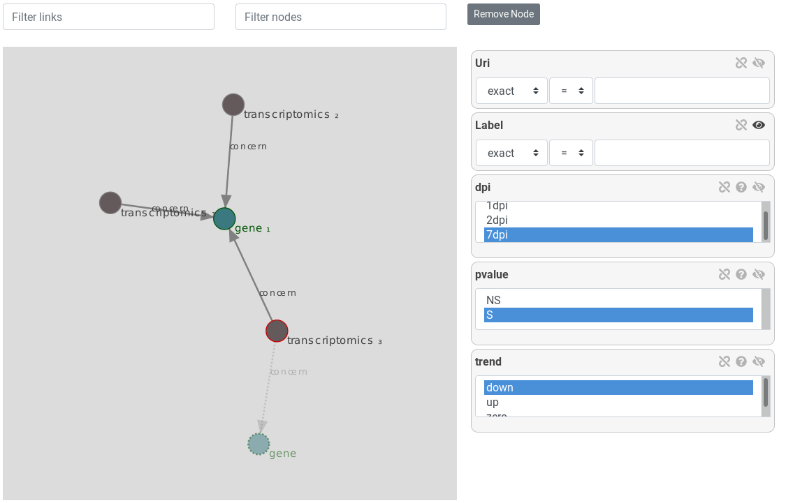

AskOmics is a collaborative web platform for data integration and query using the semantic web (RDF and SPARQL).

This guide is intended for users who want to analyze their project-specific data with AskOmics. Throughout the guide, you will find <badge class="hands-on">Hands-on</badge> containing tutorial instruction to perform in order to get started with AskOmics.

To do this tutorial, you will need an AskOmics instance. you can use [genouest](https://askomics.genouest.org) instance. You will also need input data. Data are available [here]().

## Account creation and management

### Login or signup into AskOmics

AskOmics is a mutli-user plateform. To use it, you will need an account on the instance. Use the <navbar><i class="fa fa-sign-in"></i> Login</navbar> button on the navbar, and log in using your AskOmics credentials. If you don't have already an account, fill the signup form by clicking on <askolink>signup</askolink> below the login form.

!!! Hands-on
    Create your AskOmics account (or login with your existing one)

Once your are logged, you can use all the functionalities of AskOmics.

### Manage your account

To manage your account, use the <navbar><i class="fa fa-cog"></i> Account management</navbar> tab by clicking on <navbar><i class="fa fa-user"></i> Your Name &#9662;</navbar> on the navigation bar.

Uses the forms to change your personal information.

## Data integration

AskOmics convert project specific data into RDF triples automatically. It can convert CSV/TSV, GFF and BED files. It can also integrate RDF data.

### Data upload

The first step is to upload the input files into AskOmics. Go on the *Files* page by clicking on <navbar><i class="fa fa-file"></i> Files</navbar>.

You can upload files from your computer, or distant files using an URL.

!!! Hands-on
    Upload the files `TAIR1_GFF3_genes_mRNA.gff`, `transcriptomics.tsv` and `qtl.tsv` from your computer into AskOmics

Uploaded files are displayed into the files table.

Next step is to convert this files into RDF triples. This step is called *Integration*. Integration will produce a RDF description of your data: the *Abstraction*.

### Integration

The *integration* convert input files into RDF triples, and load them into an RDF triplestore. AskOmics can convert CSV/TSV, GFF3 and BED files. Select input files from the *Files* page, and click on the <btn><i class="fa fa-database"></i> Integrate</btn> button.

#### CSV/TSV

CSV/TSV files are previewed on the integration page as a table. The first column describe the *entity* to integrate, other columns describe *relations* or *attributes* of this entity. Each column type is automatically detected by AskOmics, but it can be overrided.

- The first columns can be an *Entity* or an *Start entity* (default). Only a *Start entity* can be a start point of a query.
- Columns that respect the format `relation@entity` describe a relation of the current entity to another entity. `relation` is the name of the relation and `entity` is the targeted entity. Relations can be *Directed* (from the current entity to the target one) or *Symetric* (both direction).
- Other columns can be *Attributes*. They can be *Numeric*, *Text* or *Category*.

!!! warning
    The *Category* type store all the different values of the category in the abstraction. Use it only for attributes that have a limited number of different values

- Other columns can also be *Faldo attributes*. [Faldo](https://www.ncbi.nlm.nih.gov/pmc/articles/PMC4907002/) attributes describe genetic location of an entity. a FALDO entity will be converted in RDF using the FALDO ontology.

!!! Hands-on
    Integrate `transcriptomics.tsv` and `qtl.tsv`. a QTL is a locatable entity. Set `chromosome`, `start` and `end` as FALDO attributes (*reference*, *start* and *end*). The `transcriptomics` entity contain a relation to a `gene` entity (not integrated yet). Other attributes have repeated values. They can be integrated as *category*

#### GFF

GFF files contain genetic coordinate of entities. Each entities contained in the GFF file are displayed on the preview page. Select the entities you want to integrate.

!!! Hands-on
    Integrate the `TAIR1_GFF3_genes_mRNA.gff` file. The GFF contain the locatable entities `gene` and `mRNA`. Select both and integrate them. The `gene` entities is the entity targeted by `transcriptomics`.

#### BED

BED contain also locatable entities. You have to specify an entity name since the BED format don't specify it.

#### RDF

RDF file can be directly integrated into AskOmics. This RDF file have to contain the *abstraction* and the *data* to be correctly used in AskOmics.

#### Manage integrated datasets

All integrated files are stored in a specific named graph in the RDF triplestore. The named graph obtained are called *datasets*. You can manage the integrated *datasets* on the <navbar><i class="fa fa-database"></i> Datasets</navbar> page

The table show all integrated datasets. The *status* column show if the datasets is fully integrated or in the process of being integrated. You can delete datasets independently.

## Query

Once your data are integrated, the time has come to make requests on these data. Go to the *Ask* page by clicking on <navbar><i class="fa fa-play"></i> Ask!</navbar> on the navbar.

### Start point

On the *Ask* page, all entities available are showed on the page. 

The badge <badge class="local">local</badge> mean that the entities are stored in the local triplestore and the blue lock <i class="fa fa-lock primary"></i> mean that the entity is private (*i.e* the entity is only visible by you)

If the entities are numerous, you can filter them by enter a string in the *Filter entities* field, or by select the source of the entities. Here, we only have local entities so we can only filter with text.

To start a query, select a *start point*. You must choose the start point according to what you want to obtain at the end of the query. For example, you want *genes that are on chromosome 3*, the start point to choose is `gene`.

Start points can be filtered with the *Filter entities* box. a badge show where the entity is. Here, we only have local entities.

### Simple query

To start a query, select a start point and click on <btn>Start!</btn>

!!! Hands-on
    Start a query with `gene`

The query builder is divided into two side. The left side is the *entity graph* and the right side is the *attribute view*.

On the *entity graph*, *entities* are represented as *bubbles* and *relations* are represented as *arrows*. We can see the gene start point selected (surrounded by a red circle). From the selected gene bubble start relations to other entities. This relations are suggested (transparent and dotted). On the attribute view, attributes of the selected entities are displayed. At this point, the represented query is "Give me all genes".

!!! Hands-on
    Launch a preview of the query by clicking on <btn><i class="fa fa-table"></i> Run & preview</btn>

A preview of the results are displayed on the bottom of the page.

### Complex query

To build a complex query, we need to apply constraints to our node. Two kinf of constraints can be apply. Constraints on relations and constraints on attributes. This constraints are called *filters* From this point, we will construct the following query:

*All genes that are significantly over-expressed on day post-infection one (dpi1) and under-expressed at dpi 3 and 7.*

#### Filters on attributes

On the *attribute view*, you see all attributes of the gene entity. Each attribute is represented as an *attribute box*. Depending of the *type* of attribute (numeric, text or category), Each box type have common properties and specific properties.

- Show/hide

Each attribute have a show/hide button, represented with an eye icon <i class="fa fa-eye"></i>. By default, only the attribute label is showed (<i class="fa fa-eye"></i>), all other attributes are hidden (<i class="fa fa-eye-slash"></i>) Click on the icon to display an attribute.

!!! Hands-on
    Show the `reference`, `start` and `end` of the gene entity, and preview the results

The common properties are the show/hide button, the 

- Text attribute

A text attribute can be filtered by a string or a regexp. Use `filter types` to change the filter from `exact match` to `regexp` and to change the match to a `not match`.

!!! warning
    `exact match` is the most efficient filter. regexp and negative match can take much more time.

!!! Hands-on
    Filter the gene label with `AT1G06820` and preview the result. Then, perform a regexp filter with `^AT1G06`

- Numeric attribute

Numeric attribute can be filtered with a number. The filter type ise used to compare the number with `=`, `≠`, `>`, `<`, `≤` or `≥`.

!!! Hands-on
    Filter the `start` attribute with values superior or equal to `2000000` and preview results

- Category attribute

A category is an attribute who have a limited number of values. Each values are showed on the attribute box. To filter a category, click on each value. use `ctrl` + click to select several values or remove them.

!!! Hands-on
    Select the reference `Chr1` and `Chr2` and preview results

At this point, we have "all genes whose label start with `AT1G06` located on chr1 and chr2, and with a start value superior or equal to `2000000`".

#### Filter on relations

Filter on relations allow to link an entity to other entities. On the *entity graph*, the selected entity is surrounded by a red circle, and other entities are proposed (transparent and dotted). To instantiate a entity linked to the selected one, click on it.

!!! Hands-on
    Return to the <navbar><i class="fa fa-play"></i> Ask!</navbar> page, and restart a query with `gene`. Then, instantiate a `transcriptomics` entity, linked to our `gene` entity by clicking on it and preview results

This query represent all genes linked to a transcriptomics experiment. The transcriptomics entity represent transcriptimics experiments ...

On the attributes view, values can be filtered to contraints the results.

!!! Hands-on
    Filter the `transcriptomics` entity to get all experiments at day post infection one (dpi) with synificative values (S) and with an up trend

At this step, we have genes that are synificatively over-expressed at day one post infection.

Several same instance of entities can be linked. To get other condition, we can instanciate other transcriptomics experiments to gene.

!!! Hands-on
    Return to `gene`, and instanciate a new `transcriptomics` entity. Filter it with `dpi2`, and a `down` trend. Then re-return to gene and do the same to a third `transcriptomics` entity, but a `dpi7`. Preview results

Now, results show genes that are synificatively over-expressed at day one and under-expressed at day 2 and 7.